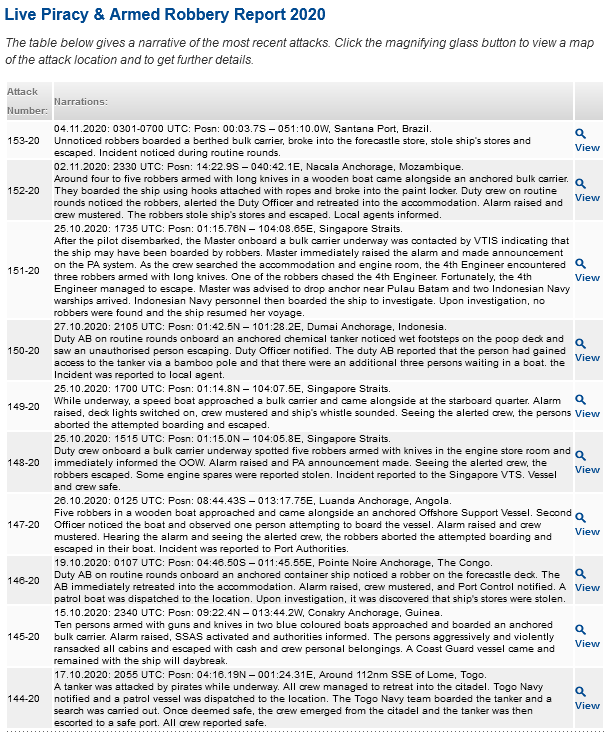
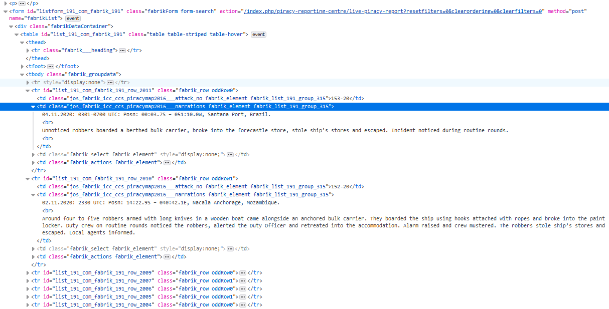
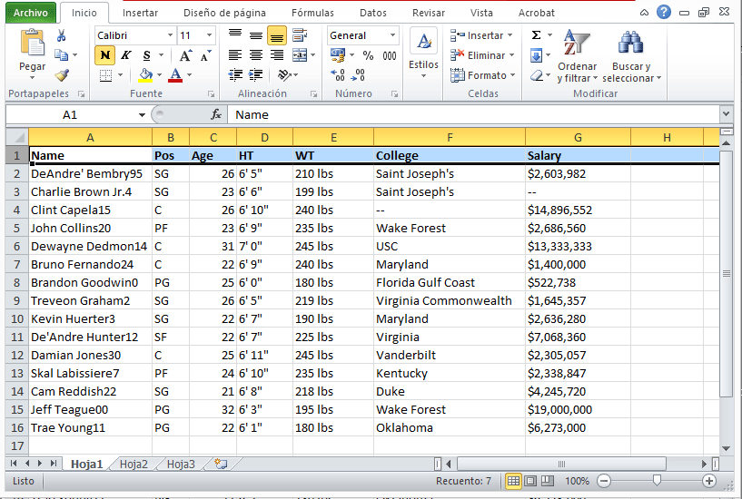

# The 21st Century Piracy Phenomenon. Exploring Contemporary Sea Piracy

## Summary

In this study the main goal is to evaluate the concentrations of the modern piracy incidents around the world.
Modern-day pirates around the world share the legal designation of their historic brethren as “enemies of all mankind” because they disrupt and hinder the safe navigation of maritime vessels containing goods and people.

Piracy is a global crime which impedes the free movement of ships containing people and goods, with its attendant economic ramifications. The perpetrators are usually heavily armed, with sophisticated weapons to enable them to hijack a vessel or vessels and redirect them to their desired location for the payment of an expected ransom.

I am using Beautiful Soup for this Python app. Beautiful Soup is a Python library for parsing data out of HTML and XML files (aka webpages). It works with your favorite parser to provide idiomatic ways of navigating, searching, and modifying the parse tree. 

The major concept with Beautiful Soup is that it allows you to access elements of your page by following the CSS structures, such as grabbing all links, all headers, specific classes, or more. It is a powerful library. Once we grab elements, Python makes it easy to write the elements or relevant components of the elements into other files, such as a CSV, that can be stored in a database or opened in other software.

The data I used came from Live Piracy & Armed Robbery Report 2020. Reference: https://www.icc-ccs.org/index.php/piracy-reporting-centre/live-piracy-report


## Main goal

+ To access all of the content from the source code of the webpage with Python
+ Parse and extract data. 
+ Save the info in CSV file for further analysis.

## Methodology

1. Import Modules
2. Get the URL link
3. Navigate the URL Data Structure
4. Testing out data requests
5. Write data to a file in pseudo-code:
    + Open up a file to write in and append data. 
    + Write headers
    + Clear HTML tag and insert text in array
    + Clear \r \n \t to prepare string variable to clear Narrations: and insert text in array
    + Prepare string variables Date, Time, Position, Area and Country, replace characters to insert character | and insert text in array
    + Split to elements to array results for character | and Write to file items Date, Time, Position, Area and Country
    + When complete, close the file
6. The output file in CSV format.

## Data info extracted:

Date, Time, Position, Area and Country of Live Piracy & Armed Robbery Report 2020



If you don't have Beautiful Soup, install with 'conda install beautifulsoup' in terminal.

Python requires us to explicitly load the libraries that we want to use:


```python
# If you don't have Beautiful Soup, install with 'conda install beautifulsoup' in terminal
# Python requires us to explicitly load the libraries that we want to use:
import requests
import bs4
import re
```

Load a webpage into python so that we can parse it and manipulate it.


```python
# Load a webpage into python so that we can parse it and manipulate it.
URL = 'https://www.icc-ccs.org/index.php/piracy-reporting-centre/live-piracy-report'
```

Control of Connection. We just turned the website code into a Python object. 


```python
# Control of Connection
# We just turned the website code into a Python object. 
response = requests.get(URL)
soup = bs4.BeautifulSoup(response.text, "html.parser")
```

Find all the tags with class narrations


```python
# find all the tags with class narrations
data = soup.findAll(attrs={'class':['jos_fabrik_icc_ccs_piracymap2016___narrations']})
```



Open new file, make sure path to your data file is correct.

Later, I write headers


```python
f = open('piracy_reporting_centre.csv','w') # open new file, make sure path to your data file is correct
f.write("Date\tTime\tPosition\tArea\tCountry" + "\n") # write headers
```


    32


```python
# Clear HTML tag and insert text in array
results = []                              # Initialize array results
for element in data:                      # Iterate over the data array
     TAG_RE = re.compile(r'<[^>]+>')      # Prepare pattern to clean html tag from str (element) strings
     text = TAG_RE.sub('', str(element))  # Apply pattern and clean text html tag
     results.append(text)                 # Insert text in array
```


```python
# Clear \r \n \t to prepare string variable to clear Narrations: and insert text in array
results_explode = []      # Initialize results_explode array
results_2 = []            # Inicializa arreglo results_2
for element in results:   # Iterate over the results array of the previous cell
     item = ''            # Initialize item
     item = str(element)  # Assigns the value of item to each element of the results array
     item = item.replace('\r', '').replace('\n', '').replace('\t', '') # Replace item \r, \n, \t to clean string and work better on it
     if item != 'Narrations:':                 # Used to clean the Narrations: chain from the string:
          results_explode = item.split(".")    # Perform explode for him. to keep the elements of the first line where they are Date, Time, Position, Area and Country and eliminate the paragraph that follows the line
          i = 0                                # Initialize i
          for result in results_explode:       # Iterate over the results_explode array
                i = i + 1
                if i <= 5: results_2.append(result) # Save the elements where they can later be extracted Date, Time, Position, Area and Country 
```


```python
# Prepare string variables Date, Time, Position, Area and Country, replace characters to insert character | and insert text in array
i = 0                      # i
results = []               # Initialize array results
for element in results_2:  # Iterate over the results_2 array
    i = i + 1
    if i == 1: 
        data1 = str(element)  # Take element data1 to make up the date
    if i == 2: 
        data2 = str(data1) + '.' + str(element) # Take element data1 and concatenate str (element) to make up the date
    if i == 3: 
        date = data2 + '.' + str(element) # take date element plus other strings and concatenate str (element) to make up the date
    if i == 4: 
        position = str(element)    # Take element position plus other strings
    if i == 5: 
        country = str(element)     # Take country element plus other strings
        item = date.replace(': Posn : ', '|').replace(': Posn: ', '|').replace(': ', '|') + '.' + position.replace(' – ', '|') + '.' + country.replace('E, ', 'E|').replace('W, ', 'W|')
        item = item.replace('N – ', 'N|').replace('W, ', 'W|') # Performs replacement of : Posn : for |, : Posn: for |, : for |,  –  for |, E, for E|, W, for W| to form a line where the elements are well delimited Date, Time, Position, Area and Country by the separator |  
        results.append(item)    # Add the line where the elements are well delimited Date, Time, Position, Area and Country by the separator | to the array results
        i = 0                   # Puts on 0 to be able to take the following 5 results_2 array elements where are the useful elements to extract
```


```python
# Split to elements to array results for character | and Write to file items Date, Time, Position, Area and Country
for element in results:
       item = element.split("|") # Perform explode by character | to keep the elements Date, Time, Position, Area and Country
       i = 0
       for element1 in item:
            i = i + 1
            if i == 1: 
                date = str(element1)
                f.write(date + "\t") # Write date and add tabulator
            if i == 2: 
                time = str(element1)
                f.write(time + "\t") # Write time and add tabulator
            if i == 3: 
                position = str(element1)
                f.write(position + "\t") # Write position and add tabulator
            if i == 4: 
                area = str(element1)
                f.write(area + "\t") # Write area and add tabulator
            if i == 5: 
                country = str(element1)
                f.write(country + "\t\n") # Write country and add tabulator                
```


```python
# Close file
f.close()
```



## Conclusiones

We used Beautiful Soup as the main tool. The major concept with Beautiful Soup is that it allows you to access elements of your page by following the CSS structures, such as grabbing all links, all headers, specific classes, or more. It is a powerful library.

 Once we grab elements, Python makes it easy to write the elements or relevant components of the elements into other files, such as a CSV, that can be stored in a database or opened in other software.
